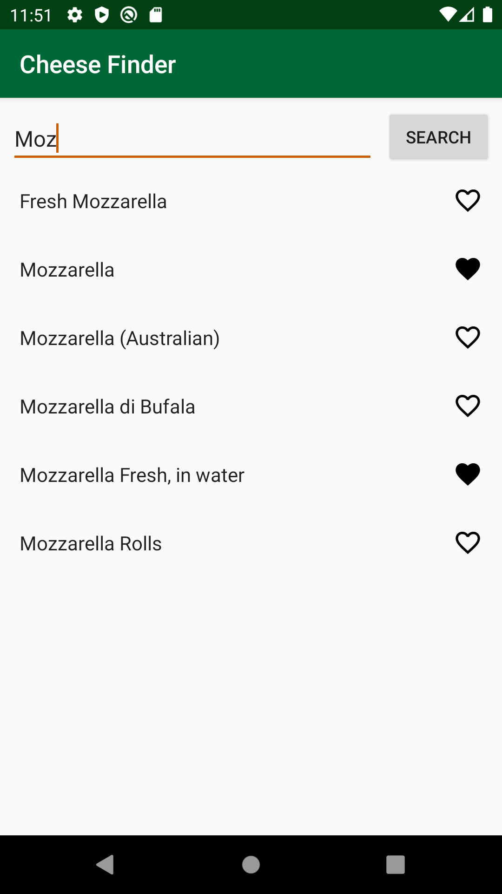

# cheesefinder-starter
An android application that demonstrates RxAndroid (RxJava for Android) in Kotlin 🧀

Learned from :https://www.raywenderlich.com/2071847-reactive-programming-with-rxandroid-in-kotlin-an-introduction
